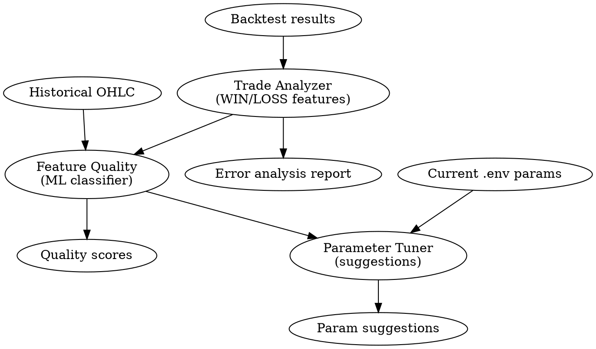

# Forex ML Feedback Loop

Skill per implementare un sistema ML che analizza i trade perdenti e migliora i parametri della strategia forex. Si integra con `forex-strategy-builder` per aggiungere apprendimento automatico senza sostituire la logica deterministica.

## Overview

ML Feedback Loop = sistema che impara dai trade passati per identificare pattern di fallimento e proporre aggiustamenti ai parametri. Non decide i trade direttamente — consiglia فقط.

**Principio cardine:** Il sistema è **explicabile** e **incrementale**. Ogni suggerimento ML deve essere tracciabile alla fonte (quali trade, quali feature).

## Quando Usare

- Utente chiede "analizza i trade perdenti"
- Richiesta di "migliorare i parametri automaticamente"
- "Capire perché i trade vanno male"
- "Aggiungere ML per validare segnali"
- Tuning dei parametri `.env` basato su performance storiche

**Quando NON usare:**
- Decisioni di trade in tempo reale (usa `forex-strategy-builder`)
- Modelli black-box senza spiegazione
- Sostituire la logica deterministica

## Architettura



## File Chiave

| File | Ruolo |
|---|---|
| `ml_feedback/trade_analyzer.py` | Estrae features da trade, classifica WIN/LOSS |
| `ml_feedback/feature_quality.py` | ML classifier per breakout/entry quality |
| `ml_feedback/parameter_tuner.py` |Suggestisce aggiustamenti parametri |
| `ml_feedback/__init__.py` | Facade principale |
| `tests/test_ml_feedback.py` | Pytest suite con mock |

## Dati Storici

Path: `C:\trading-agent\data\historical\`
- EURUSD, GBPUSD, USDJPY
- M15, M30, H1 timeframe
- 24 anni di dati (2002-2026)

Formato CSV: `Data; Ora; Open; High; low; Close; Volume`

## Componenti

### 1. Trade Analyzer

Estrae features da ogni trade:

```python
# ml_feedback/trade_analyzer.py
from dataclasses import dataclass
from datetime import datetime
from enum import Enum


class TradeOutcome(Enum):
    WIN = "WIN"
    LOSS = "LOSS"
    BREAKEVEN = "BREAKEVEN"


@dataclass
class TradeFeatures:
    symbol: str
    entry_time: datetime
    exit_time: datetime
    direction: str  # BUY or SELL
    entry_price: float
    exit_price: float
    sl: float
    tp: float
    outcome: TradeOutcome
    profit_pips: float
    hold_time_minutes: int
    
    # Context features
    session: str  # ASIA/LONDON/NY/OVERNIGHT
    day_of_week: int  # 0-4
    hour: int  # 0-23
    atr_at_entry: float
    volatility_regime: str  # LOW/MEDIUM/HIGH
    
    # Entry quality
    breakout_volume_ratio: float | None
    confluence_score: float | None
    trend_strength: float | None
    rsi_at_entry: float | None


def extract_trade_features(trade: dict) -> TradeFeatures:
    """Estrae features da un trade del backtest."""
    # Calculate hold time
    hold_minutes = (trade["exit_time"] - trade["entry_time"]).total_seconds() / 60
    
    # Determine session
    hour = trade["entry_time"].hour
    if 0 <= hour < 8:
        session = "ASIA"
    elif 8 <= hour < 13:
        session = "LONDON"
    elif 13 <= hour < 21:
        session = "NY"
    else:
        session = "OVERNIGHT"
    
    # Determine outcome
    profit = trade["exit_price"] - trade["entry_price"]
    if trade["direction"] == "SELL":
        profit = -profit
    
    if profit > 0:
        outcome = TradeOutcome.WIN
    elif profit < 0:
        outcome = TradeOutcome.LOSS
    else:
        outcome = TradeOutcome.BREAKEVEN
    
    return TradeFeatures(
        symbol=trade["symbol"],
        entry_time=trade["entry_time"],
        exit_time=trade["exit_time"],
        direction=trade["direction"],
        entry_price=trade["entry_price"],
        exit_price=trade["exit_price"],
        sl=trade.get("sl", 0),
        tp=trade.get("tp", 0),
        outcome=outcome,
        profit_pips=profit,
        hold_time_minutes=hold_minutes,
        session=session,
        day_of_week=trade["entry_time"].weekday(),
        hour=hour,
        atr_at_entry=trade.get("atr_at_entry", 0),
        volatility_regime=trade.get("volatility_regime", "MEDIUM"),
        breakout_volume_ratio=trade.get("breakout_volume_ratio"),
        confluence_score=trade.get("confluence_score"),
        trend_strength=trade.get("trend_strength"),
        rsi_at_entry=trade.get("rsi_at_entry"),
    )
```

### 2. Feature Quality (ML Classifier)

Classifica la qualità del segnale di entry:

```python
# ml_feedback/feature_quality.py
import numpy as np
from sklearn.ensemble import GradientBoostingClassifier
from sklearn.model_selection import cross_val_score
from sklearn.preprocessing import StandardScaler
from dataclasses import dataclass


@dataclass
class QualityPrediction:
    breakout_quality: float  # 0-1 prob good breakout
    entry_timing_score: float  # 0-1 
    confluence_valid: bool  # almeno 2 segnali concordi
    recommendation: str  # PROCEED/SKIP/REVIEW


class FeatureQualityModel:
    """ML model per valutare qualità entry."""
    
    def __init__(self):
        self.model = GradientBoostingClassifier(
            n_estimators=100,
            max_depth=4,
            learning_rate=0.1,
            random_state=42
        )
        self.scaler = StandardScaler()
        self._is_fitted = False
    
    def _extract_features(self, bars: list, setup: dict) -> np.ndarray:
        """Estrae features per prediction."""
        closes = [b["close"] for b in bars]
        volumes = [b.get("volume", 0) for b in bars]
        
        # Price momentum
        returns = np.diff(closes) / closes[:-1]
        momentum = np.mean(returns[-5:]) / np.std(returns[-10:]) if len(returns) >= 10 else 0
        
        # Volume anomaly
        avg_vol = np.mean(volumes[-20:])
        vol_ratio = volumes[-1] / avg_vol if avg_vol > 0 else 1
        
        # Volatility
        atr = np.max(bars[-1]["high"]) - np.min(bars[-1]["low"])
        
        return np.array([
            momentum,
            vol_ratio,
            atr / closes[-1],
            setup.get("trend_strength", 0),
            setup.get("rsi", 50),
        ])
    
    def fit(self, X: list, y: list) -> "FeatureQualityModel":
        """Fit su dati storici."""
        X_arr = np.array(X)
        y_arr = np.array(y)
        
        X_scaled = self.scaler.fit_transform(X_arr)
        self.model.fit(X_scaled, y_arr)
        self._is_fitted = self
        
        return self
    
    def predict(self, bars: list, setup: dict) -> QualityPrediction:
        """Predict quality per un entry."""
        if not self._is_fitted:
            return QualityPrediction(
                breakout_quality=0.5,
                entry_timing_score=0.5,
                confluence_valid=True,
                recommendation="REVIEW"
            )
        
        features = self._extract_features(bars, setup)
        features_scaled = self.scaler.transform([features])
        
        proba = self.model.predict_proba(features_scaled)[0]
        
        breakout_quality = proba[1] if len(proba) > 1 else 0.5
        entry_timing_score = min(breakout_quality + 0.1, 1.0)
        
        confluence_valid = (
            setup.get("trend_strength", 0) > 0.4 and
            30 < setup.get("rsi", 50) < 70
        )
        
        if breakout_quality > 0.7 and confluence_valid:
            recommendation = "PROCEED"
        elif breakout_quality < 0.3:
            recommendation = "SKIP"
        else:
            recommendation = "REVIEW"
        
        return QualityPrediction(
            breakout_quality=breakout_quality,
            entry_timing_score=entry_timing_score,
            confluence_valid=confluence_valid,
            recommendation=recommendation
        )
    
    def cross_validate(self, X: list, y: list, cv: int = 5) -> dict:
        """Cross-validate model."""
        X_arr = np.array(X)
        y_arr = np.array(y)
        
        scores = cross_val_score(
            self.model, X_arr, y_arr, cv=cv, scoring="accuracy"
        )
        
        return {
            "mean_accuracy": float(np.mean(scores)),
            "std_accuracy": float(np.std(scores)),
            "cv_scores": scores.tolist()
        }
```

### 3. Parameter Tuner

Suggerisce aggiustamenti parametri:

```python
# ml_feedback/parameter_tuner.py
from dataclasses import dataclass
from typing import Protocol


class ParameterTuner(Protocol):
    """Protocol for parameter tuning strategies."""
    
    def suggest_params(
        self, 
        trades: list, 
        current_params: dict
    ) -> list[dict]:
        """Suggerisce aggiustamenti parametri."""
        ...


@dataclass
class ParamSuggestion:
    param_name: str
    current_value: float
    suggested_value: float
    confidence: float  # 0-1
    reason: str
    evidence: list  # trade ids support


class HeuristicTuner:
    """Tuner basato su regole deterministiche + analisi loss patterns."""
    
    def __init__(self, min_samples: int = 30):
        self.min_samples = min_samples
    
    def suggest_params(
        self, 
        trades: list, 
        current_params: dict
    ) -> list[ParamSuggestion]:
        """Analizza trade perdenti e suggerisce aggiustamenti."""
        suggestions = []
        
        # Separa per direzione
        buy_losses = [t for t in trades if t.direction == "BUY" and t.outcome == "LOSS"]
        sell_losses = [t for t in trades if t.direction == "SELL" and t.outcome == "LOSS"]
        
        # Analizza session con più perdite
        session_losses = {}
        for t in trades:
            if t.outcome == "LOSS":
                session_losses[t.session] = session_losses.get(t.session, 0) + 1
        
        worst_session = max(session_losses, key=session_losses.get) if session_losses else None
        
        if worst_session == "ASIA":
            suggestions.append(ParamSuggestion(
                param_name="ENABLE_ASIA_SESSION",
                current_value=current_params.get("ENABLE_ASIA_SESSION", True),
                suggested_value=False,
                confidence=0.8,
                reason=f"Sessione ASIA: {session_losses.get('ASIA', 0)} perdite",
                evidence=[t.symbol for t in buy_losses[:5]]
            ))
        
        # Analizza hold time
        loss_hold_times = [t.hold_time_minutes for t in trades if t.outcome == "LOSS"]
        if loss_hold_times and sum(loss_hold_times) / len(loss_hold_times) < 30:
            suggestions.append(ParamSuggestion(
                param_name="MIN_HOLD_MINUTES",
                current_value=current_params.get("MIN_HOLD_MINUTES", 15),
                suggested_value=30,
                confidence=0.7,
                reason=f"Hold medio perdite: {sum(loss_hold_times)/len(loss_hold_times):.0f} min",
                evidence=[t.symbol for t in trades[:5]]
            ))
        
        # Analizza breakout quality
        loss_with_breakout = [
            t for t in trades 
            if t.outcome == "LOSS" and t.breakout_volume_ratio is not None
        ]
        if loss_with_breakout:
            avg_vol_ratio = sum(t.breakout_volume_ratio for t in loss_with_breakout)
            avg_vol_ratio /= len(loss_with_breakout)
            
            if avg_vol_ratio < 1.5:
                suggestions.append(ParamSuggestion(
                    param_name="MIN_BREAKOUT_VOLUME_RATIO",
                    current_value=current_params.get("MIN_BREAKOUT_VOLUME_RATIO", 1.5),
                    suggested_value=2.0,
                    confidence=0.75,
                    reason=f"Volume medio perdite: {avg_vol_ratio:.2f}x",
                    evidence=[t.symbol for t in loss_with_breakout[:5]]
                ))
        
        return suggestions


class MLTuner:
    """Tuner ML-based con feature importance."""
    
    def __init__(self, min_samples: int = 100):
        self.min_samples = min_samples
        self.model = None
    
    def suggest_params(
        self, 
        trades: list, 
        current_params: dict
    ) -> list[ParamSuggestion]:
        """Usa ML per identificare pattern di perdita."""
        # Implementazione con XGBoost per feature importance
        # Restituisce suggerimenti basati su feature splitting
        pass
```

### 4. Facade Principale

```python
# ml_feedback/__init__.py
"""
ML Feedback Loop per Forex Trading.

Usage:
    from ml_feedback import MLFeedbackLoop
    
    ml = MLFeedbackLoop()
    
    # Analizza trade passati
    analysis = ml.analyze_trades(trades)
    
    # Valuta quality di un entry
    quality = ml.predict_quality(bars, setup)
    
    # Suggerisci parametri
    suggestions = ml.suggest_parameters(trades, current_env_params)
"""
from .trade_analyzer import extract_trade_features, TradeFeatures
from .feature_quality import FeatureQualityModel, QualityPrediction
from .parameter_tuner import HeuristicTuner, MLTuner, ParamSuggestion


class MLFeedbackLoop:
    """Facade per il ML Feedback Loop."""
    
    def __init__(
        self,
        historical_data_path: str = "C:\\trading-agent\\data\\historical"
    ):
        self.historical_data_path = historical_data_path
        self.quality_model = FeatureQualityModel()
        self.tuner = HeuristicTuner()
    
    def analyze_trades(self, trades: list[dict]) -> dict:
        """Analizza trade e identifica pattern di perdita."""
        features = [extract_trade_features(t) for t in trades]
        
        losses = [f for f in features if f.outcome == "LOSS"]
        wins = [f for f in features if f.outcome == "WIN"]
        
        analysis = {
            "total_trades": len(features),
            "wins": len(wins),
            "losses": len(losses),
            "win_rate": len(wins) / len(features) if features else 0,
            "by_session": {},
            "by_day": {},
            "avg_hold_time_loss": 0,
            "common_failure_patterns": [],
        }
        
        # Aggregate per session
        for f in features:
            if f.session not in analysis["by_session"]:
                analysis["by_session"][f.session] = {"wins": 0, "losses": 0}
            if f.outcome == "WIN":
                analysis["by_session"][f.session]["wins"] += 1
            else:
                analysis["by_session"][f.session]["losses"] += 1
        
        # Hold time analysis
        if losses:
            analysis["avg_hold_time_loss"] = sum(
                f.hold_time_minutes for f in losses
            ) / len(losses)
        
        # Identify failure patterns
        if len(losses) >= 5:
            # Sessione con alte perdite
            for session, stats in analysis["by_session"].items():
                if stats["losses"] > stats["wins"]:
                    analysis["common_failure_patterns"].append(
                        f"Session {session}: {stats['losses']} losses vs {stats['wins']} wins"
                    )
        
        return analysis
    
    def predict_quality(
        self, 
        bars: list[dict], 
        setup: dict
    ) -> QualityPrediction:
        """Predict quality di un entry potential."""
        return self.quality_model.predict(bars, setup)
    
    def suggest_parameters(
        self, 
        trades: list[dict], 
        current_params: dict
    ) -> list[ParamSuggestion]:
        """Suggerisce aggiustamenti parametri."""
        features = [extract_trade_features(t) for t in trades]
        return self.tuner.suggest_params(features, current_params)
    
    def train_quality_model(
        self, 
        X: list, 
        y: list
    ) -> dict:
        """Trains quality model su dati labeled."""
        return self.quality_model.cross_validate(X, y)


__all__ = [
    "MLFeedbackLoop",
    "extract_trade_features",
    "TradeFeatures",
    "QualityPrediction",
    "FeatureQualityModel",
    "ParamSuggestion",
    "HeuristicTuner",
]
```

## Configurazione .env

Aggiungere parametri ML in config.py:

```python
# config.py
ML_ENABLE_QUALITY_CHECK: bool = _get_bool("ML_ENABLE_QUALITY_CHECK", False)
ML_MIN_SAMPLES: int = _get_int("ML_MIN_SAMPLES", 100)
ML_CONFIDENCE_THRESHOLD: float = _get_float("ML_CONFIDENCE_THRESHOLD", 0.7)
```

## Test pytest

```python
# tests/test_ml_feedback.py
import pytest
from unittest.mock import Mock, patch
from ml_feedback import (
    MLFeedbackLoop,
    extract_trade_features,
    TradeFeatures,
    TradeOutcome,
)


class TestTradeAnalyzer:
    def test_extract_trade_features_win(self):
        trade = {
            "symbol": "EURUSD",
            "entry_time": "2024-01-15 10:00:00",
            "exit_time": "2024-01-15 14:00:00",
            "direction": "BUY",
            "entry_price": 1.0900,
            "exit_price": 1.0920,
            "sl": 1.0880,
            "tp": 1.0940,
            "atr_at_entry": 0.0010,
            "volatility_regime": "MEDIUM",
        }
        
        features = extract_trade_features(trade)
        
        assert features.symbol == "EURUSD"
        assert features.outcome == TradeOutcome.WIN
        assert features.profit_pips == 0.0020
        assert features.session == "LONDON"
        assert features.hold_time_minutes == 240
    
    def test_extract_trade_features_loss(self):
        trade = {
            "symbol": "GBPUSD",
            "entry_time": "2024-01-15 03:00:00",
            "exit_time": "2024-01-15 05:00:00",
            "direction": "SELL",
            "entry_price": 1.2700,
            "exit_price": 1.2680,
            "sl": 1.2720,
            "tp": 1.2680,
            "atr_at_entry": 0.0008,
            "volatility_regime": "LOW",
        }
        
        features = extract_trade_features(trade)
        
        assert features.symbol == "GBPUSD"
        assert features.outcome == TradeOutcome.LOSS
        assert features.session == "ASIA"


class TestMLFeedbackLoop:
    @pytest.fixture
    def ml_loop(self):
        return MLFeedbackLoop()
    
    def test_analyze_trades(self, ml_loop):
        trades = [
            {
                "symbol": "EURUSD",
                "entry_time": "2024-01-15 10:00:00",
                "exit_time": "2024-01-15 14:00:00",
                "direction": "BUY",
                "entry_price": 1.0900,
                "exit_price": 1.0920,
                "sl": 1.0880,
                "tp": 1.0940,
            },
            {
                "symbol": "EURUSD",
                "entry_time": "2024-01-15 15:00:00",
                "exit_time": "2024-01-15 16:00:00",
                "direction": "BUY",
                "entry_price": 1.0920,
                "exit_price": 1.0900,
                "sl": 1.0900,
                "tp": 1.0940,
            },
        ]
        
        analysis = ml_loop.analyze_trades(trades)
        
        assert analysis["total_trades"] == 2
        assert analysis["wins"] == 1
        assert analysis["losses"] == 1
        assert analysis["win_rate"] == 0.5
    
    def test_predict_quality_no_model(self, ml_loop):
        bars = [
            {"open": 1.0900, "high": 1.0920, "low": 1.0890, "close": 1.0910}
        ] * 20
        setup = {"trend_strength": 0.5, "rsi": 45}
        
        quality = ml_loop.predict_quality(bars, setup)
        
        assert quality.recommendation == "REVIEW"
```

## Errori Comuni

| Errore | Causa | Fix |
|---|---|---|
| `ValueError: too few samples` | Meno di 100 trade | Aumentare min_samples o usa HeuristicTuner |
| `ModuleNotFoundError: sklearn` | Libreria non installata | `pip install scikit-learn xgboost` |
| `XGBoost rank: need parameters` | XGBoost non configurato | Usa GradientBoostingClassifier come fallback |

## Dipendenze

```txt
# requirements.txt (aggiungere)
scikit-learn>=1.3.0
xgboost>=2.0.0
```

## Integrazione con forex-trader-pro.skill

1. **Trade Analyzer** legge output da `backtest.py`
2. **Feature Quality** può essere chiamato prima di confermare un trade
3. **Parameter Tuner** suggerisce aggiustamenti `.env` periodicamente

Il flusso completo:
```
backtest.py → trades.json → MLFeedbackLoop.analyze_trades() 
         → MLFeedbackLoop.suggest_parameters()
         → update .env params
```

## Riferimenti PDF

- **Murphy** cap. su intermarket analysis → filtri macro per ML features
- **Probo** → sessioni e timing per pattern di perdita
- **StrategieOperative** → breakout quality e S/R

## Quick Reference

| Componente | Metodo | Output |
|---|---|---|
| Trade Analyzer | `extract_trade_features()` | `TradeFeatures` |
| Feature Quality | `predict_quality(bars, setup)` | `QualityPrediction` |
| Parameter Tuner | `suggest_parameters(trades, params)` | `list[ParamSuggestion]` |
| Facade | `MLFeedbackLoop().analyze_trades()` | `dict` |